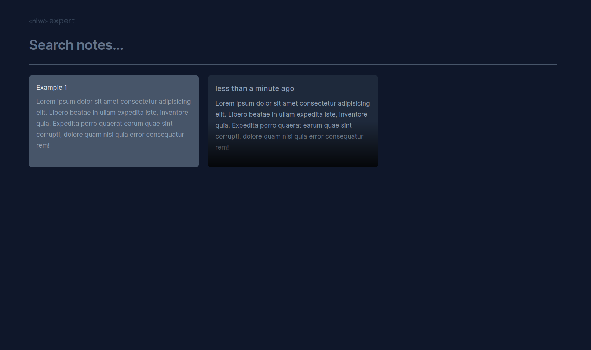
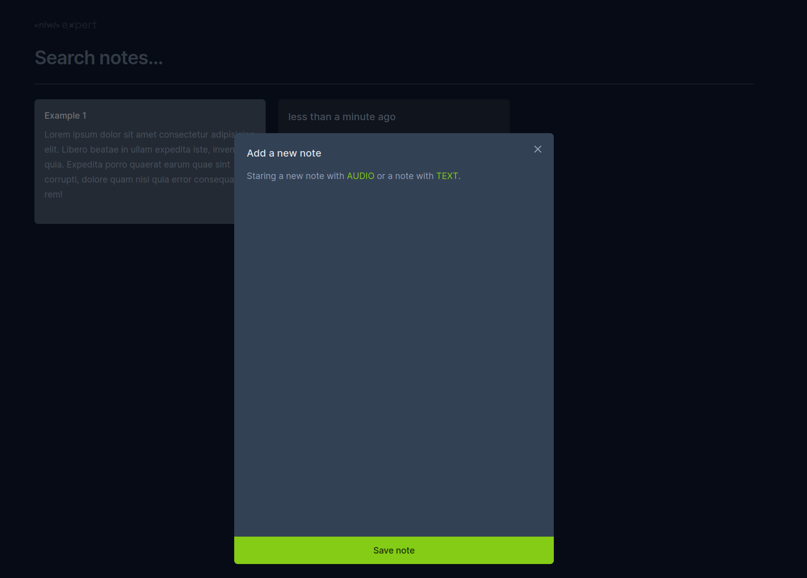

  <h1 align="center">Speech to Text</h1>

## About
This notes app in React, transforms speech in audio to `text`, using `speech-to-text api`.

  
  

## Layout:
To access the layout use [Figma](https://www.figma.com/file/p9MKhYcZHNhLHgZWkXrcE8/NLW-expert-%E2%80%A2-Notes-(Community)?type=design&node-id=102%3A1489&mode=design&t=UacV0vCuRQuAfIEm-1).

## Run this project
1. cd notes
2. npm run dev

## References:
- [React Documentation](https://reactjs.org/)
- [RocketSeat](https://www.rocketseat.com.br/)
- [AssemblyAI](https://www.assemblyai.com/)
- [Lucide Icons](https://lucide.dev/icons/)
- [Radix-ui](https://www.radix-ui.com/)
- [sonner](https://sonner.emilkowal.ski/)
- [Diego3g](https://github.com/diego3g)

## Copyright:
Please note, this is a very simple project, however, it may contain some part of the code that may be Copyright. All the people were duly referenced in the `"References"` section above.

Please also note that this project is `non-profit` and not intended to be monetized.

---

<strong>Built with 💙 by [@Marcos Oliveira](https://www.linkedin.com/in/pgmarcosoliveira/)</strong>